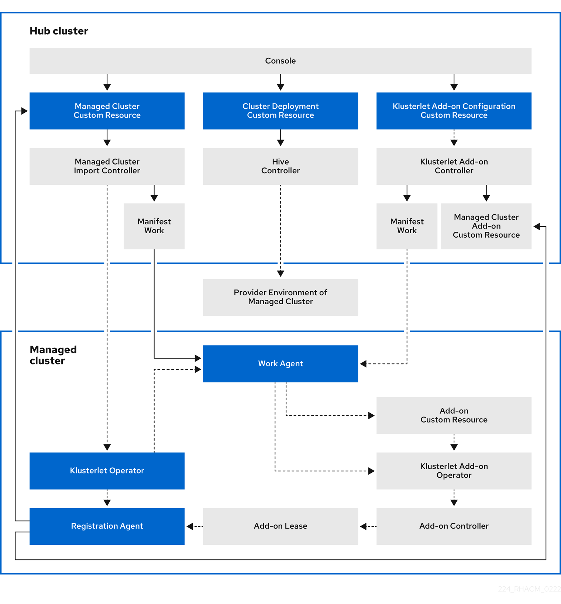

# **Cluster Infrastructure Management Using PXE**

Anyone who has used Red Hat Advanced Cluster Management for Kubernetes knows it offers a multitude of ways to manage and deploy the OpenShift cluster lifecycle depending on whether one is deploying on prem or within one of the supported clouds.  In Red Hat Adavanced Cluster Management for Kubernetes 2.4 the Cluster Infrastructure Management interface, which is reliant on using the Assisted Installer behind the scenes, was introduced.  This option for deploying a baremetal cluster relied on server nodes that could support the mounting the discovery image via virtual media if the goal was to do zero touch provisioning.  However this lead to a gap for hardware that did not have the virtual media capability but still wanted to be deployed without having to actually take a USB stick with the image into the datacenter.

With the introduction of Red Hat Advanced Cluster Management for Kubernetes 2.5.1 we are introducting the capability of being able to PXE boot servers via the Cluster Infrastructure Management interface.  This feature will breath new life into those hosts that suffered the lack of remote virtual media mounts. Let's go ahead and see how this new option will work in a practical example.

First lets talk a bit about the reference architecture I am using.  I currently have a Red Hat Advanced Cluster Management for Kubernestes 2.5.1 hub cluster running on a 3 node compact OpenShift 4.10.16 cluster with OpenShift Data Foundation 4.10 acting as the storage for any of my persisten volume requirements.  Further I have a ISCP DHCP server setup on my private network of 192.168.0.0/24 to provide DHCP reservations for the 3 hosts we will discover via the PXE boot method and deploy OpenShift onto.

First let's create the ClusterImageset resource yaml which will point to our mirrored instance of OpenShift 4.10.16 in Quay:

~~~bash
~ % cat << EOF > ~/kni20-clusterimageset.yaml
apiVersion: hive.openshift.io/v1
kind: ClusterImageSet
metadata:
  name: openshift-v4.10.16
  namespace: open-cluster-management
spec:
  releaseImage: quay.io/openshift-release-dev/ocp-release:4.10.16-x86_64
EOF  
~~~

Now let's apply the cluster imageset to the cluster:

~~~bash
~ % oc create -f ~/kni20-clusterimageset.yaml 
clusterimageset.hive.openshift.io/openshift-v4.10.16 created
~~~

Next we need to create a mirror config which tells the assisted image service where to get the images from, since we are using a disconnected installation to deploy clustersN+1.  This configuration should contain the CA certificate and any registry references to ensure that the cluster being deployed knows to pull the images it needs from the local registry.

Let's create the config using the below:

~~~bash
~ % cat << EOF > ~/kni20-mirror-config.yaml
apiVersion: v1
kind: ConfigMap
metadata:
  name: kni20-mirror-config
  namespace: open-cluster-management
  labels:
    app: assisted-service
data:
  registries.conf: |
    unqualified-search-registries = ["docker.io"]

    [[registry]]
      prefix = ""
      location = "registry.redhat.io/rhacm2"
      mirror-by-digest-only = true

    [[registry.mirror]]
      location = "quay.io:443/acm-d"

    [[registry]]
      prefix = ""
      location = "registry.redhat.io/multicluster-engine"
      mirror-by-digest-only = true

    [[registry.mirror]]
      location = "quay.io:443/acm-d"

    [[registry]]
      prefix = ""
      location = "registry.access.redhat.com/openshift4/ose-oauth-proxy"
      mirror-by-digest-only = true

    [[registry.mirror]]
      location = "registry.redhat.io/openshift4/ose-oauth-proxy"      
EOF
~~~

Now let's create the mirror configuration on cluster0:

~~~bash
~ % oc create -f kni20-mirror-config.yaml 
configmap/kni20-mirror-config created
~~~

For Assisted Installer we need to create an agent service configuration resource that will tell the operator how much storage we need for the various components like database and filesystem. It will also define which OpenShift versions to maintain.

~~~bash
~ % cat << EOF > ~/kni20-agentserviceconfig.yaml
kind: AgentServiceConfig
metadata:
 name: agent
spec:
  iPXEHTTPRoute: enabled
  databaseStorage:
    accessModes:
    - ReadWriteOnce
    resources:
      requests:
        storage: 20Gi
  filesystemStorage:
    accessModes:
    - ReadWriteOnce
    resources:
      requests:
        storage: 20Gi
  mirrorRegistryRef:
    name: "poc-mirror-config"
  osImages:
    - openshiftVersion: "4.10"
      version: "410.84.202205191234-0"
      url: "https://mirror.openshift.com/pub/openshift-v4/x86_64/dependencies/rhcos/4.10/4.10.16/rhcos-4.10.16-x86_64-live.x86_64.iso"
      rootFSUrl: "https://mirror.openshift.com/pub/openshift-v4/x86_64/dependencies/rhcos/4.10/4.10.16/rhcos-4.10.16-x86_64-live-rootfs.x86_64.img"
      cpuArchitecture: "x86_64"
EOF
~~~

Once the agent service configuration file is created apply it to the cluster:

~~~bash
~ % oc create -f ~/kni20-agentserviceconfig.yaml
agentserviceconfig.agent-install.openshift.io/agent created
~~~

After a few minutes validate that the pods for the Infrastructure operator have started:

~~~bash
~ % oc get pods -n open-cluster-management |grep assisted
assisted-image-service-595484bc6c-cr2ww                           1/1     Running   0            3m10s
assisted-service-66768fbbd9-ncwrl                                 2/2     Running   1 (27s ago)  3m

~ % oc get pvc -n open-cluster-management 
NAME                      STATUS   VOLUME                                     CAPACITY   ACCESS MODES   STORAGECLASS                  AGE
assisted-service          Bound    pvc-13150c6f-7b16-48c4-bb1b-cd81f94f9259   100Gi      RWO            ocs-storagecluster-ceph-rbd   3m35s
postgres                  Bound    pvc-4bd16251-780e-40ac-9fa2-897b4ab9f71b   100Gi      RWO            ocs-storagecluster-ceph-rbd   3m35s
search-redisgraph-pvc-0   Bound    pvc-4cb27249-ccdb-491c-8a1c-3fa2908e67e6   10Gi       RWO            ocs-storagecluster-ceph-rbd   9d

~ % oc get routes -n open-cluster-management
NAME                     HOST/PORT                                                                                    PATH   SERVICES                 PORT                     TERMINATION          WILDCARD
assisted-image-service   assisted-image-service-open-cluster-management.apps.magic-metal-cluster.simcloud.apple.com          assisted-image-service   assisted-image-service   reencrypt            None
assisted-service         assisted-service-open-cluster-management.apps.magic-metal-cluster.simcloud.apple.com                assisted-service         assisted-service         reencrypt            None
multicloud-console       multicloud-console.apps.magic-metal-cluster.simcloud.apple.com                                      management-ingress       https                    reencrypt/Redirect   None
~~~

We have now completed the additional configuration steps needed for Hive and Assisted Installer.

~~~bash
% oc create namespace kni21
namespace/kni21 created
~~~

### Credentials

We need to create a secret that will hold the pull-secret credentials.

Next create a kubernetes secret to hold the credentials.

~~~bash
% oc create secret generic pull-secret -n kni21 --from-file=.dockerconfigjson=disconnected-quay-merged-pull-secret.json --type=kubernetes.io/dockerconfigjson
secret/pull-secret created
~~~

### Infraenv

In the infraenv manifest we should tweak the following fields:
- `sshAuthorizedKey` - ssh public key that will be added to `core` username's authorized_keys in the initial ISO booted live system

Let's generate the infraenv manifest:
~~~bash
% cat << EOF > ~/infraenv.yaml
---
apiVersion: agent-install.openshift.io/v1beta1
kind: InfraEnv
metadata:
  name: kni21
  namespace: kni21
spec:
  agentLabels:
    project: kni21
  sshAuthorizedKey: "ssh-rsa AAAAB3NzaC1yc2EAAAADAQABAAABgQC/fp2Kc5yzvpMJWYXzCKhdgYyuJE8Zf5RnhQ0vbjFwDNkPizdecgy+uBaopFpVU/lpRtHgWX3+2+vDvDcoZcrMna1EL6bEfJuE6X/2bDu786MX3t2GVUG8kBfoAymXugedU+I8H+YtgjRuHpXdiUtXNxk2n+7LeDviGB5Bgf6zjCcOiS8996iasISIYHTAikRtoYNodSQYEFjFN3ja+P7Smtk6TCWPmpkPXqKY3KtRuj/TCivWH2c/zIrFHtKhifJrAkrfFIX6w6qPaT42RRHvOwAHf5D+2jNcvaPzvRXiBkbOznoW/P5vN9hui8BdybbxZ7CBwcaW9JXalq34zRhVoYeiDoRLGYy62CJQaI6ISXO5tLjokWz39/phMkVUH+LMKpZVSvmQ7dWJyuTgEM66NMUFRZv/G4QqMNqCPoD6P3YSppzvc7cSS68ABGH+pRI0sN6KjD6dOKzjKYkxTyi9ja+j0oY9I55C7fsyck/pMZFP2FlM3B3l6N9M39fJEGU= javipolo@javipolos-MacBook-Pro.local"
  pullSecretRef:
    name: pull-secret
EOF
~~~

And now lets create the infraenv on cluster0:
~~~bash
% oc create -f ~/infraenv.yaml
infraenv.agent-install.openshift.io/kni21 created
~~~

### Download ISO
Once we have the infraenv created, assisted-service will create an ISO image for it
We can then proceed to download the full ISO file:

~~~bash
% oc get infraenv -n magic-carpet magic-carpet -o jsonpath='{.status.isoDownloadURL}' | sed s/minimal-iso/full-iso/g | xargs curl -kLo ~/magic-carpet.iso
  % Total    % Received % Xferd  Average Speed   Time    Time     Time  Current
                                 Dload  Upload   Total   Spent    Left  Speed
100  999M  100  999M    0     0  4194k      0  0:04:03  0:04:03 --:--:-- 5531k
~~~
